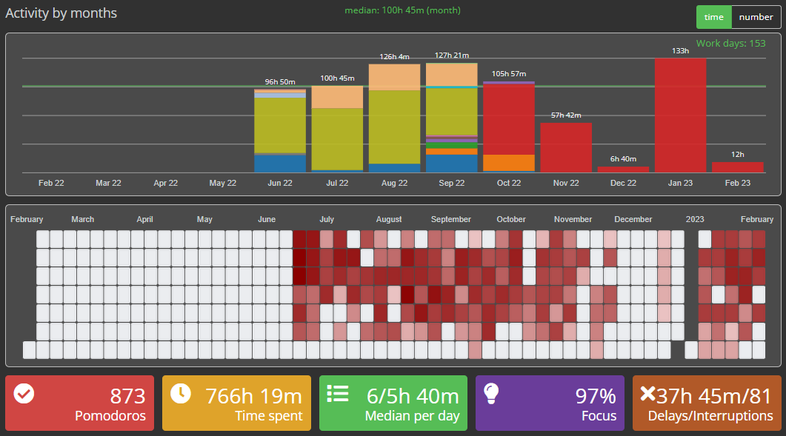

<h2 align="center">Oracle Certified Professional: Java SE 17 Developer 
1Z0-829</h2>

### Index
* [Resources](#resources)
* [Theory Preparation](#theory-preparation)
* [Exam Preparation](#exam-preparation)
* [Exam Execution Strategy](#exam-execution-strategy)
* [General Content](#general-content)
* [Certification Statistics](#certification-statistics)
* [Pomodoro](#pomodoro)
* [Module 01](#module-01)
* [Module 02](#module-02)
* [Module 03](#Module-03)
* [Module 04](#Module-04)
* [Module 05](#Module-05)
* [Module 06](#Module-06)
* [Module 07](#Module-07)
* [Module 08](#Module-08)
* [Module 09](#Module-09)

### Resources
   1. [OCP Oracle Certified Professional Java SE 17 Developer Study Guide: Exam 1Z0-829](https://www.wiley.com/en-us/OCP+Oracle+Certified+Professional+Java+SE+17+Developer+Study+Guide%3A+Exam+1Z0+829-p-9781119864585)
   2. [Java SE 11 Developer 1Z0-819 OCP Course - Part 1](https://www.udemy.com/course/java-se-11-developer-1z0-819-ocp-course-part-1/)
   3. [Java SE 11 Developer 1Z0-819 OCP Course - Part 2](https://www.udemy.com/course/java-se-11-developer-1z0-819-ocp-course-part-2/)
   4. [Devnexus 2022 - Preparing for the Java Cert and Learning New Features (Part 2) - Scott S, Jeanne B](https://www.youtube.com/watch?v=zq9z_e2pMMI)
   5. [EnthuWare Studio](https://enthuware.
      com/oca-ocp-java-certification-resources/277-ocp-java-17-certification-preparation)

### Theory Preparation
 1. Theory Preparation:
    * Prepares the candidate for:
      * Technical interviews
      * Real Daily-routine (working programming):
        * Sources: Book + Udemy Course
 2. Strategy:
    * Code concept-proofs
    * Read textbooks (OCP Study Guide)
    * Take Udemy Course (Java SE 11 Developer 1Z0-819 OCP Course)
      * Highlight courses PDF's
      * Divide the content in 8 study-blocks
    * Review weekly the Highlighted PDFs afte course conclusion

### Exam Preparation
1. Exam-Questions Preparation:
  * Prepares the candidate for:
    * Exam by itself
2. Simulate REAL Exam using Enthuware Studio
 * Take the Exam as the REAL one, including time management
 * Correct the simulated-exams (all questions - corrects + mistakes)
 * Check the mistakes periodically:
   * Understand the reason of mistake
   * Repeat the question

### Exam Execution Strategy
* **_Round 01:_** Focus in reach 68% - basic approval
  * Short-questions: Crystal clear answers
  * Mark/leave the following questions for _Round 02_: _Check alternative answers anyway, just in case_
    * Short-questions: Doubt about the answer
    * Long-questions: Doubt about the answer
    * Long-questions: Crystal clear answers
* **_Round 02:_** Focus in reach 32% - optimal approval
    * Lastly, answer _properly_ the questions marked in round 01

### General Content
   * Comparative: 1Z0-829[Java 17] x 1Z0-819[Java 11]
   * Compatative: Primitive Table
   * Strategical-Plan SpreedSheet
   * Preparing for the Java cert and learning new features (Scott S, Jeanne B)

### Certification Statistics
   * PersonVUE: 2021 Value of IT Certification Report
   * Oracle: The Value of IT Certication
   * PersonVUE: The value of certification for IT professionals

### Pomodoro
* The Pomodoro technique is a time management method that can be used for any task.
* This Track-record did not count May22(training start)

### Module 01
   * Imports + Static imports
   * Java Primitive datatypes and String APIs
   * TextBlock (Java 17 - Extra)
   * Switch and Pattern Matching (Java 17 - Extra) 
   * Operators and Decision constructs
+ [*Download*](https://drive.google.com/file/d/1Clp9UXQP7qR36c-pHHJm10GrRc6yhKtb)

### Module 02
   * Java Fundamentals (Enums and etc…)
   * Describing and using Object Classes
   * Creating and Using Methods
   * Encapsulation
+ [*Download*](https://drive.google.com/file/d/1Cm6tuxcpmAUrOJHmygskF1j_oMPwwKcg)

### Module 03
   * Reusing Implementations through Inheritance
   * Sealed Class + Records (Java 17 - Extra)
   * Programming Abstractly through Interfaces
   * Java Interfaces
+ [*Download*](https://drive.google.com/file/d/1Cr-l3amECIBBpwuEG4aj6lFE7EI2Hrtx)

### Module 04
   * Exception Handling
   * Exception Handling
   * Database Applications with JDBC + Transactions
   * Localization
+ [*Download*](https://drive.google.com/file/d/1DLbfTelHb46yHCpzEuhmzAfxH0SPB-if)

### Module 05
   * Understanding Modules
   * Migrating to a Modular Application
   * Services in Modular Application
   * Concurrency
+ [*Download*](https://drive.google.com/file/d/1DDsCL0oxwZR67MUnRX4qyxhUl0SCI3nB)

### Module 06
   * Functional Interface and Lambda Expressions
   * Built-in Functional Interfaces
   * Java Stream API
   * Lambda Operations on Stream + Optional
+ [*Download*](https://drive.google.com/file/d/1CsAVFFA56b0Q4ekwNmkD8INeTaGayJcZ)

### Module 07
   * Parallel Streams
   * I/O (Fundamentals and NIO2)
+ [*Download*](https://drive.google.com/file/d/1DKqHKQBvd3K-c2E_8YH5oqEQsWwxW_S8)

### Module 08
   * Working with Java Arrays
   * Generics and Collections
+ [*Download*](https://drive.google.com/file/d/1D8e6N5KFz5A_1shFUhFFeBsY3avV1Zeq)