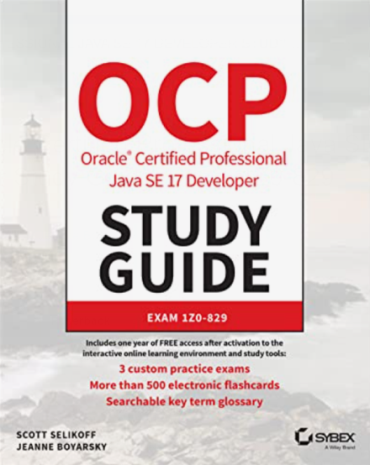
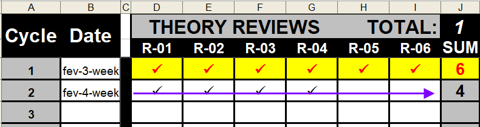

<h2 align="center">Learning Journey</h2>
<h2 align="center">Oracle Certified Professional: Java SE 17 Developer 1Z0-829</h2>

### Index
* [Exam Toughness](#exam-toughness)
* [Resources](#resources)
* [Theory Preparation](#theory-preparation)
* [Exam Preparation](#exam-preparation)
* [Exam Preparation Questions Mistakes](#exam-preparation-questions-mistakes)
* [Exam Execution Strategy](#exam-execution-strategy)
* [General Content](#general-content)
* [Statistics](#statistics)
* [Certification Dificulty](#statistics)
* [Pomodoro](#pomodoro)
* [Module 01](#module-01)
* [Module 02](#module-02)
* [Module 03](#Module-03)
* [Module 04](#Module-04)
* [Module 05](#Module-05)
* [Module 06](#Module-06)
* [Module 07](#Module-07)
* [Module 08](#Module-08)
* [Module 09](#Module-09)
* [Code Labs](#code-labs)
* [Mindset](#mindset)

### Exam Toughness
* Oracle Java exams are considered "one of the most" tough in the software-development-world...
* Do not hear the people say "in 2 months you will pass". In the exam Java "1Z0-829 OCD", it can take more time. Think realystically.
* [1Z0-829 OCD](https://education.oracle.com/java-se-17-developer/pexam_1Z0-829) | [1Z0-819 OCD](https://education.oracle.com/cat%C3%A1logo-de-produtos-ouexam-pexam_1z0-819/pexam_1Z0-819) is much harder, because it sort of englobes [comparison](https://www.selikoff.net/ocp11-819/):
  * Professional Programmer I (Old 1Z0-815)
  * Professional Programmer II (Old 1Z0-817)
* Time is crucial point - Usually, no time for reviews or regrets:
  * 1Z0-829 OCD | 1Z0-819 OCD: 90 Minutes - 50 Questions
  * 1Z0-815 OCP-I | 1Z0-816 OCP-II: 180 Minutes - 80 Questions
* Even the OCP Study Guide Authors, [Jeanne](https://www.selikoff.net/about-jeanne/) and [Scott](https://www.selikoff.net/about-scott/), don't reach "rocket sky scores" (verified till 01-feb-2023):
  * [Jeanne’s experience taking the 1Z0-819 in the time of COVID-19](https://www.selikoff.net/2020/09/26/jeannes-experience-taking-the-1z0-819-in-the-time-of-covid-19/)
  * [Taking the 1Z0-819 Exam: Study Everything and Watch the Clock!](https://www.selikoff.net/2020/10/05/taking-the-1z0-819-exam-study-everything-and-watch-the-clock-part-1-of-2/)
  * [Jeanne’s 1Z0-829 experience](https://www.selikoff.net/2021/12/18/jeannes-1z0-829-experience/)

### Resources
   1. [OCP Oracle Certified Professional Java SE 17 Developer Study Guide: Exam 1Z0-829](https://www.wiley.com/en-us/OCP+Oracle+Certified+Professional+Java+SE+17+Developer+Study+Guide%3A+Exam+1Z0+829-p-9781119864585)
   2. [OCP Oracle Certified Professional Java SE 17 Developer Practice Tests: Exam 1Z0-829](https://www.amazon.ca/Oracle-Certified-Professional-Developer-Practice/dp/1119864615/ref=sr_1_1?crid=19EOAO42OWY2L&keywords=OCP+Oracle+Certified+Professional+Java+SE+17+Developer+Practice+Tests%3A+Exam+1Z0-829&qid=1675291583&s=books&sprefix=ocp+oracle+certified+professional+java+se+17+developer+practice+tests+exam+1z0-829%2Cstripbooks%2C119&sr=1-1)
   3. [Java SE 11 Developer 1Z0-819 OCP Course - Part 1](https://www.udemy.com/course/java-se-11-developer-1z0-819-ocp-course-part-1/)
   4. [Java SE 11 Developer 1Z0-819 OCP Course - Part 2](https://www.udemy.com/course/java-se-11-developer-1z0-819-ocp-course-part-2/)
   5. [Devnexus 2022 - Preparing for the Java Cert and Learning New Features (Part 2) - Scott S, Jeanne B](https://www.youtube.com/watch?v=zq9z_e2pMMI)
   6. [EnthuWare Studio](https://enthuware.com/oca-ocp-java-certification-resources/277-ocp-java-17-certification-preparation)

### Theory Preparation
 1. Theory Preparation:
    * Prepares the candidate for:
      * Technical interviews
      * Real Daily-Routine technical challenges:
        * Sources: TextBook + Udemy Course
 2. Strategy:
    * Code concept-proofs
    * Read textbooks (OCP Study Guide)
    * Take Udemy Course (Java SE 11 Developer 1Z0-819 OCP Course)
      * Highlight course's PDFs
      * Content divided in 8 study-blocks
    * Review weekly the PDFs after course conclusion

### Exam Preparation
1. Exam-Questions Preparation:
  * Prepares the candidate for:
    * Exam by itself
2. Simulates REAL Exam using Enthuware Studio
 * Take the Exam as the REAL one
   * Including time management
3. Correct the simulated-exams:
   * Review the right ones 
   * Corrects the mistakes
     * List ALL mistakes (they should review periodically)

### Exam Preparation Questions Mistakes
1. :recycle:Review mistakes "periodically":
   * Understand and explain for yourself, the reason of the mistakes
   * Repeat the mistaken question listed in the topic above
2. :recycle: Golden Rules:
   * Mistakes are most efficent "source" of knowledge
   * Mistakes are not a SHAME, actually they are the "precise parameters" for improvements
   * More mistakes 'done', 'understood' and 'reviewed', means more knowldge acquired, not only for the Exam, but 
     also for Professional-Life.

### Exam Execution Strategy
* **_Round 01:_** Focus in reach 68% - basic approval
  * Short-questions: Crystal clear answers
  * Mark/leave the following questions for _Round 02_: _Check alternative answers anyway, "**better safe than sorry**"_
    * Short-questions: Doubt about the answer
    * Long-questions: Doubt about the answer
    * Long-questions: Crystal clear answers
* **_Round 02:_** Focus in reach 32% - optimal approval
    * Lastly, answer _properly_ the questions marked in round 01

### General Content
   * Comparative: 1Z0-829[Java 17] x 1Z0-819[Java 11]
   * Compatative: Primitive Table
   * Strategical-Plan SpreedSheet
   * Preparing for the Java cert and learning new features (Scott S, Jeanne B)

### Statistics
   * PersonVUE: 2021 Value of IT Certification Report
   * Oracle: The Value of IT Certication
   * PersonVUE: The value of certification for IT professionals

### Pomodoro
* The Pomodoro technique is a time management method that can be used for any task.
* The Track-record below did not count May22(training start)

### Module 01
   * Imports + Static imports
   * Java Primitive datatypes and String APIs
   * TextBlock (Java 17 - Extra)
   * Switch and Pattern Matching (Java 17 - Extra) 
   * Operators and Decision constructs
+ [*Download*](https://mega.nz/file/JnR1jbYI#Nzzi1GfMijDzil8-dNk6GtGileFe6EVLoXHGyX7Ks3A)

### Module 02
   * Java Fundamentals (Enums and etc…)
   * Describing and using Object Classes
   * Creating and Using Methods
   * Encapsulation
+ [*Download*](https://mega.nz/file/k6Y0XYhT#29mot9X_Beu4rMjhTKZPsbkwf2ghTRXx9NhcQM4mWOU)

### Module 03
   * Reusing Implementations through Inheritance
   * Sealed Class + Records (Java 17 - Extra)
   * Programming Abstractly through Interfaces
   * Java Interfaces
+ [*Download*](https://mega.nz/file/lj5g0Y6b#tkUZpEeBvKyTrtSkQlcYexWPxUCpWUe-JXx9Qe-qUs8)

### Module 04
   * Exception Handling
   * Exception Handling
   * Database Applications with JDBC + Transactions
   * Localization
+ [*Download*](https://mega.nz/file/I3oByBxJ#Hk5PG7p-vR42HUKa6YyrW-NKrOzNER4Ai9M_2J2i05s)

### Module 05
   * Understanding Modules
   * Migrating to a Modular Application
   * Services in Modular Application
   * Concurrency
+ [*Download*](https://mega.nz/file/FmQi2IAL#B2sUFweqZOPi_NdXN4E5Q_VuCMRiIX2sxM18LUK00HM)

### Module 06
   * Functional Interface and Lambda Expressions
   * Built-in Functional Interfaces
   * Java Stream API
   * Lambda Operations on Stream + Optional
+ [*Download*](https://mega.nz/file/Bih3BCbL#i92D8r7uA5bPp-dHC_33T6CtuXLB8uP_dQi-IZBmUeA)

### Module 07
   * Parallel Streams
   * I/O (Fundamentals and NIO2)
+ [*Download*](https://mega.nz/file/4nAGDbYY#YUI4Y3KPVPwohdFZfzCAAnK4wTfZIgcm9lnjdHNNPh0)

### Module 08
   * Working with Java Arrays
   * Generics and Collections
+ [*Download*](https://mega.nz/file/4rQEgTRL#K1tbcJ8Dznke_LoLXzDuNjaEQfQOoKNf297umAYYmHM)

### Code Labs
1. [Extras](https://github.com/codegtd/certification-java17-1Z0829-extras)
2. [Functional Interfaces](https://github.com/codegtd/certification-java17-1Z0829-funct-interfaces)
3. [Miscelaneous 1](https://github.com/codegtd/certification-java17-1Z0829-miscelanous)
4. [Miscelaneous 2](https://github.com/codegtd/certification-java17-1Z0829-exam-training)
5. [Streams Operations](https://github.com/codegtd/certification-java17-1Z0829-funct-stream-lambdas-operations)
6. [Localization,NIO2 and JDBC](https://github.com/codegtd/certification-java17-1Z0829-localiz-NIO2-JDBC)
7. [Concurrency](https://github.com/codegtd/certification-java17-1Z0829-funct-concurrency)
8. [Parallel Streams](https://github.com/codegtd/certification-java17-1Z0829-funct-parallel-streams)
9. [Streams Api 1](https://github.com/codegtd/certification-java17-1Z0829-funct-stream-api)
10. [Streams Api 2](https://github.com/codegtd/certification-java17-1Z0829-funct-streams-file)
11. [Modules and SPI's 1](https://github.com/codegtd/certification-java17-1Z0829-modules-spi-v1)
12. [Modules and SPI's 2](https://github.com/codegtd/certification-java17-1Z0829-modules-spi-v2) 

### Mindset:
* Be realistic about the _**actual reason**_ for the certification, meaning... Certification must not be seen as a 
  paper to place in your wall, on the contraty, it must be seem as a technical and complete theory preparation journey for your professional life as a developer
* NEVER... NEVER... NEVER GIVE UP...
* The Journey will be hard and lonely, but keep walking, keep going...
* You won't be the first/last to work super hard to pass in the Oracle Java Exam...
* Oracle Exams claims sacrificing, but its worthwhile, you will grow up technically a lot... Enjoy the journey...
* When failing in the exam-simulations, keep going, dont "fell blue"...
* Keep working and, overtime, you will find the right track to reach the enough marks to get the approval...
* When you get upset with your failings... [whatch motivational content, like it](https://www.youtube.
  com/watch?v=YBYuDdfEnnc), and remember...If the character got his goal, overcoming all challenges, you will do the 
  same....
* Before the Final Victory, a lot thinks will be fixed/rethought/adjusted/trained, till the success. When necessary 
  CHANGE, do not keep doing the same strategy!!!
